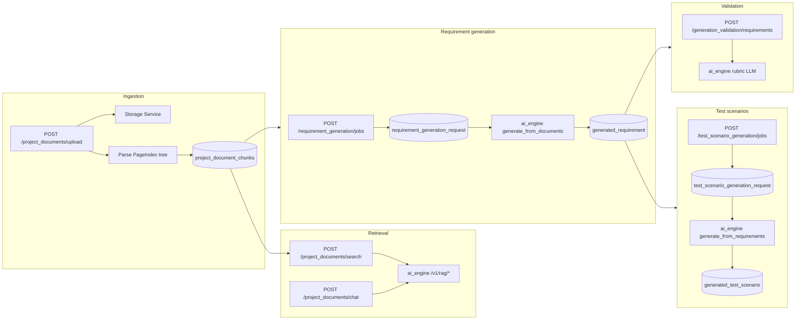

# AI-assisted generation — architecture

CyFAST’s Gen AI V&V features span **document ingestion**, **vectorless RAG**, **requirement generation**, **draft validation**, and **test scenario generation**. General Management orchestrates persistence, queues, and HTTP; the Python **AI Engine** performs LLM calls and hybrid retrieval. Storage Service holds raw files; MongoDB holds PageIndex chunk trees.

**HTTP route tables:** [General Management API](apis/general-management.md) (operator-facing) and [AI Engine API](apis/ai-engine.md) (internal LLM/RAG). **Do not duplicate** those path lists here.

## End-to-end flow

Typical operator sequence: upload documents until `status=INDEXED` → generate requirements from selected docs → optionally validate drafts → approve into `requirement` → generate test scenarios from approved requirements → approve into `test_scenario`.

## Configuration

| Variable | Consumer | Purpose |
|----------|----------|---------|
| `AI_ENGINE_URL` | General Management | Base URL (e.g. `http://127.0.0.1:8099`). Unset: embedded Node `rag-service.js` for search/chat only; generation, validation, and LLM chat **fail** or degrade per route. |
| `AI_ENGINE_LLMS_TIMEOUT_MS` | General Management | HTTP timeout for LLM-backed calls (default **600000** ms). Must be ≥ `LLM_HTTP_TIMEOUT_SECONDS` on ai_engine. |
| `LLM_PROVIDER`, `OPENAI_*`, `OLLAMA_*` | AI Engine | Model backend (see `ai_engine/.env.example`). |
| `MONGODB_URI`, `MYSQL_*` | AI Engine | Chunk retrieval and indexed document listing. |
| `MESSAGING_TYPE=rabbitmq` | General Management | Required for async generation jobs (listeners in `messaging/rabbitmq/`). |

## Document ingestion

**Code:** `apis/general_management/services/project-document-service.js`, routes under `/project_documents`.

1. **Upload** — Multipart `POST /project_documents/upload` creates a MySQL `project_document` row (`UPLOADED`), uploads bytes to Storage Service (`partition_key` = project id, folder from `doc_type`), then sets `PARSING`.
2. **Parse / index** — Async `parseAndIndex` runs `document-parser-service` (PageIndex-style tree), replaces MongoDB `project_document_chunks` for that id, sets `INDEXED` with `chunk_count` / `page_count`. Failures set `FAILED` and `parse_status_detail`.
3. **Notify AI Engine** — On `INDEXED`, GM POSTs `internal/documents/indexed` so ai_engine can refresh document awareness (optional).
4. **Reparse** — `POST /project_documents/:id/reparse` schedules the same pipeline (202, poll `status`).

**Doc types** (catalog `GET /project_documents/doc_types`): `BRD`, `SRS`, `FRS`, `REGULATORY`, `SAFETY_REQUIREMENTS`, `EXPORTED_REQUIREMENTS`, `EXPORTED_TEST_CASES`, `DESIGN`, `OTHER`.

**RAG at GM:** `POST /project_documents/search` and `/chat` call ai_engine `/v1/rag/search` and `/v1/rag/chat` when configured; otherwise Node `rag-service.js` (lexical/tree fallback).

Schema: `databases/MYSQL/cyfast2/2.0.0/04_project_documents.sql`; chunks are not in SQL.

## Shared job model

Table `job` (see `05_requirement_generation.sql`, `07_test_scenario_generation.sql`, `07_job_additional_instructions.sql`) stores async AI work:

| `job_type` | Queue (`messaging.json`) | Listener |
|------------|---------------------------|----------|
| `REQUIREMENT_GENERATION` | `requirement_generation_request` | `listener-requirement-generation.js` |
| `TEST_SCENARIO_GENERATION` | `test_scenario_generation_request` | `listener-test-scenario-generation.js` |

**Statuses:** `QUEUED` → `PROCESSING` → `COMPLETED` or `FAILED`. Create endpoints return **202** with `async_processing: true`; clients poll `GET .../jobs/:jobId` or list pending candidates.

**Draft tables:** `generated_requirement` / `generated_test_scenario` with `approval_status` (`PENDING`, `APPROVED`, rejected/discarded flows). Approve promotes rows into `requirement` or `test_scenario` (see factories in `database/mysql/factories/`).

**Optional fields:** `additional_instructions` (generation hints), `user_feedback` (regenerate), `raw_llm_response`, `error_message`.

## Requirement generation

**GM service:** `requirement-generation-service.js`  
**AI Engine:** `POST /v1/requirements/generate_from_documents`, `.../regenerate_from_documents`

- Job input: `project_id`, `organization_id`, `document_ids[]` (must be **INDEXED**), `requirement_categories[]` (e.g. `FUNCTIONAL`, `SAFETY`, `REGULATORY` — see `ALLOWED_CATEGORIES` in service).
- Context: hybrid RAG over selected documents (`buildDocumentContext`) plus optional `additional_instructions` (also fed into RAG query fragments).
- Output: bulk insert `generated_requirement` candidates; user approves/rejects/regenerates via `/requirement_generation/*` routes.

Topic-only generation (`POST /v1/requirements/generate`) exists on ai_engine but is **not** exposed through GM HTTP today.

## Generation validation

**GM proxy:** `/generation_validation/*` → ai_engine `/v1/generation_validation/*`  
**Code:** `ai_engine/app/generation_validation/`, prompts in `shared/prompts.py`

| GM path | Purpose |
|---------|---------|
| `POST /generation_validation/requirements` | Rubric scores per draft (dimensions: correct, complete, consistent, testable, traceable, compliant, non_ambiguous, domain_aligned). Optional `document_context_snippet`, `related_drafts`. |
| `POST /generation_validation/test_cases` | Validates test-case drafts vs optional `source_requirements`. |
| `POST /generation_validation/other` | Custom checklist for arbitrary artifacts (`artifact_type`, `artifact_summary`, `checklist[]`). |

Validation is **synchronous** (no job queue). UI or tools call GM; GM does not persist validation results unless the client stores them.

**Note:** Full **test case generation** (`POST /v1/test_cases/generate` on ai_engine) is not wired to GM routes yet—only validation and legacy manual test-case CRUD under `/test_cases`.

## Test scenario generation

**GM service:** `test-scenario-generation-service.js`  
**AI Engine:** `POST /v1/test_scenarios/generate_from_requirements`, `.../regenerate_from_requirements`

- Input: approved requirements (`all_approved` or `requirement_ids[]`), `scenario_types[]` (`FUNCTIONAL`, `NEGATIVE`, `BOUNDARY`, …), optional `safety_options` (`safety_validation`, `fault_handling`, `data_integrity`), optional `additional_instructions`.
- Output: `generated_test_scenario` rows linked to `requirement_id`; approve creates `test_scenario` (dedupe via `dedupe_hash`).
- Read approved scenarios: `GET /test_scenarios`, `GET /test_scenarios/:testScenarioId`.

## User notifications

Async work and ingestion emit rows consumed by `GET /user_notifications/me` (`06_user_notification.sql`). Categories include `document_ingestion`, `requirement_generation`, `test_scenario_generation` (see `async-user-notify` usage in services).

## Related components

- [General Management API — architecture](architecture-general-management.md) — Fastify mount points and RabbitMQ startup.
- [Storage Service — architecture](architecture-storage-service.md) — blob layout used by uploads.
- [System overview](architecture-overview.md) — platform diagram including AI Engine.
- [Web UI — architecture](architecture-ui.md) — project views for documents, requirements, test scenarios (client only).
