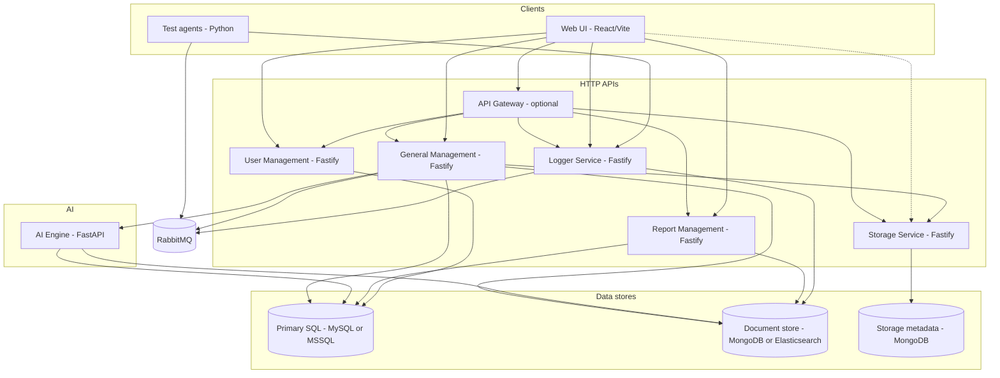

# CyFast2 — system architecture overview

CyFast2 is a verification and test orchestration platform. At runtime it is composed of **Fastify** HTTP APIs (general, report, user, logger, storage, and an optional **API gateway**), a **Python AI Engine** for document RAG and LLM generation, a **Python test agent** over **RabbitMQ**, and a **React** UI. Gen AI V&V flows (ingestion → requirements → validation → test scenarios) are described in **[AI-assisted generation](architecture-ai-generation.md)**—not repeated here.

## Logical architecture

## Responsibilities at a glance

| Layer | Role |
|-------|------|
| **User Management** | JWT-based authentication and authorization; users, roles, permissions backed by Sequelize on the configured primary database. |
| **API Gateway** | Optional single entry (ports **80** / **8080**); proxies `/services/*` to backend APIs (`apis/api_gateway/`). |
| **General Management** | Domain API for projects, requirements, risks, traceability, test artifacts, orchestrations, agents, **project documents**, **AI generation jobs**, and **validation** proxies; RabbitMQ for agents and async generation. See [AI-assisted generation](architecture-ai-generation.md). |
| **AI Engine** | FastAPI LLM service: RAG, requirement/scenario generation, validation rubrics; called by GM via `AI_ENGINE_URL` (default port **8099**). |
| **Report Management** | Design templates, report sections and templates, and report generation (HTML, PDF, Word, datasets) using data from the primary database and templates in the secondary store. |
| **Logger Service** | REST endpoints under `/logs/*` for structured logging; subscribes to `console_log_exchange` when RabbitMQ is enabled to persist console streams. |
| **Storage Service** | File blobs and metadata; used by project document ingestion (see [AI-assisted generation](architecture-ai-generation.md) and `docs/architecture-storage-service.md`). |
| **Test Agent** | Long-running worker: registers with the engine, executes framework-specific tests (Robot, Pytest, SpecFlow, CAPL), optional parsing mode, heartbeats and control commands over RabbitMQ; can POST logs and artifacts to the logger service. |
| **Web UI** | Operator-facing SPA; uses separate Axios instances (CyFAST, CyLog, CyUser) mapped to the backend base URLs from environment configuration. |

## Configuration pattern

Each API loads **`NODE_ENV`** (default `local`), **`DATABASE_TYPE_PRIMARY`** / **`DATABASE_TYPE_SECONDARY`**, and **`MESSAGING_TYPE`** from the environment, then merges JSON under each service’s `config/` or `configs/` folder. Ports and host URLs come from per-environment `app.json` (or equivalent).

## Related assets

- **Database schema scripts**: `databases/MYSQL/cyfast2/` (versioned SQL).
- **Deep dive (test agent only)**: `test_agent/architecture.md`.
