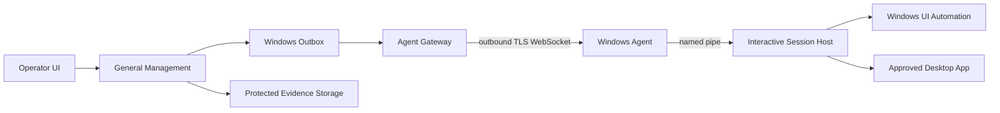
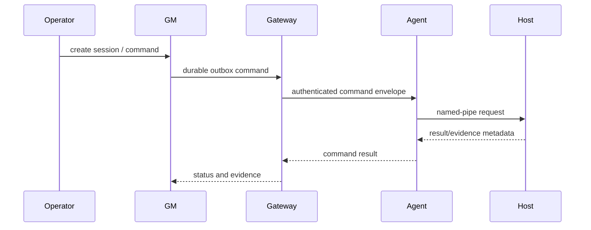

# W1 Architecture

The agent is outbound-only and never connects to RabbitMQ. The Session Host runs in the user desktop context; the service cannot automate a locked/non-interactive desktop.

Rollback: disable `WINDOWS_AUTOMATION_ENABLED`, stop the agent/gateway, apply `09_windows_connect_w1_down.sql` only when removing W1 tables, then revert deployment.
